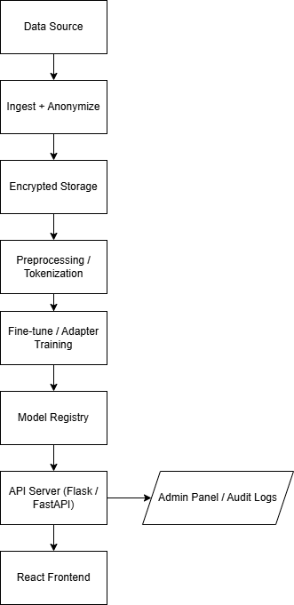

# System Architecture — Personal AI Clone

## Overview
The Personal AI Clone system is designed to securely collect, preprocess, and fine-tune a personalized language model that emulates a user's communication style.  
It ensures privacy, consent, and accountability at each stage of the data and model lifecycle.

The architecture follows a modular, privacy-by-design approach.

---

## Components

### 1. Data Sources
- Raw inputs: SMS exports, chat logs, or email text.
- Collected **only after consent** using the signed form in `data_plan/consent_form.txt`.

### 2. Ingest + Anonymize
- Scripts in `data_plan/cleaning_snippets.py` remove PII (names, emails, phone numbers).
- Outputs stored in `data/raw_encrypted/` folder.

### 3. Encrypted Storage
- All raw and processed data encrypted using **AES-256**.
- Encryption keys handled via `.env` (with `python-dotenv`) and never committed to the repo.
- This storage layer ensures compliance with GDPR data protection requirements.

### 4. Preprocessing / Tokenization
- Data is cleaned, normalized, and tokenized into the format needed by transformer models.
- Handled using Python notebooks or data pipeline scripts (`notebooks/preprocess.ipynb`).

### 5. Fine-tune / Adapter Training
- A transformer (e.g., GPT-2, T5, or LLaMA variant) is fine-tuned on anonymized user text.
- Uses **parameter-efficient adapter tuning** (Houlsby et al.) for low-resource personalization.
- All experiments logged and saved in `models/`.

### 6. Model Registry
- Stores model checkpoints, metadata, and evaluation metrics.
- May use local directory or cloud storage (e.g., Hugging Face Hub private space).
- Each version is linked to its data and consent record.

### 7. API Server (Flask / FastAPI)
- Provides secure endpoints for text generation and evaluation.
- Handles requests from frontend and audit logs access.
- Integrates authentication for safe use.

### 8. Admin Panel / Audit Logs
- Internal dashboard for monitoring model access, training runs, and usage logs.
- Logs all data accesses, model runs, and output generations for transparency.

### 9. React Frontend
- User-facing interface for prompt input and personalized response generation.
- Provides “review and approve” step before sending any AI-generated message.
- Connects to API via secure HTTPS (TLS).

---

## Data Flow Summary

1. **User gives consent** → uploads text data.  
2. **Data is anonymized** → stored encrypted.  
3. **Preprocessing** prepares training data.  
4. **Model is fine-tuned/adapted** → saved to model registry.  
5. **API Server** serves personalized responses.  
6. **Frontend** interacts with user for demo or research use.  
7. **Audit logs** track each action for ethical oversight.

---

## Deployment Notes

- Recommended to use **Docker Compose** for containerized deployment:
  - `backend` (FastAPI)
  - `frontend` (React)
  - `model` (local or cloud inference)
  - `db` (for logs and registry)
- Environment variables managed via `.env` and secrets manager.
- Optional: Run entire stack locally to preserve user privacy.

---

## Diagram

Architecture visualization:

---

## Future Enhancements
- Federated learning for on-device personalization.
- Differential privacy for anonymized gradient sharing.
- Automated compliance audit reports.
